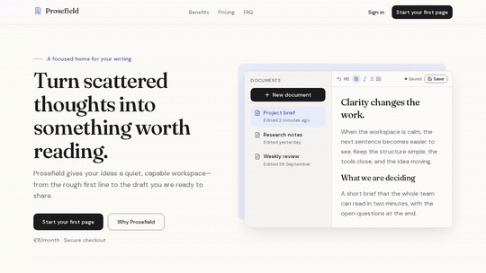
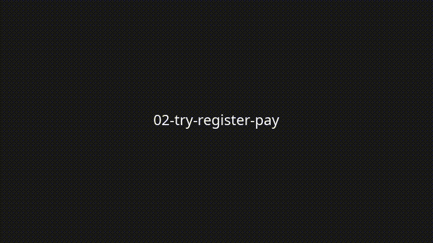
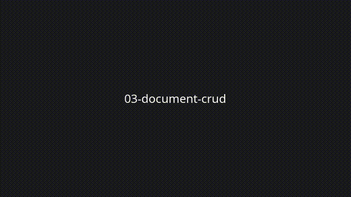

# Prosefield

A local-first writing workspace: register, subscribe, and keep pages with less friction.

## Demo

Regenerate with `pnpm demo:gifs` (Docker + ffmpeg).







## Quick start

Works on **macOS**, **Linux**, and **Windows via WSL2** (Ubuntu) with [Docker Desktop’s WSL2 backend](https://docs.docker.com/desktop/features/wsl/). On Windows, follow Microsoft’s [WSL install guide](https://learn.microsoft.com/en-us/windows/wsl/install) and run every command **inside WSL2** — not PowerShell or Git Bash.

1. **Clone**

   ```bash
   git clone https://github.com/gassius/prosefield.git
   cd prosefield
   ```

2. **Check** your machine (prints pass/fail; stops with install links if something is missing)

   ```bash
   bash scripts/check.sh
   ```

3. **Start** (installs project dependencies, starts the backend in Docker, runs the app)

   ```bash
   bash scripts/start.sh
   ```

Open http://localhost:3000. Stop with `bash scripts/stop.sh`.

## Let your agent set up and run this project

Paste this into any coding agent (or point it at the raw file):

```text
Follow https://raw.githubusercontent.com/gassius/prosefield/main/AGENT_SETUP.md
end to end. Stop and ask me before any system-wide install.
```

Full prompt: [`AGENT_SETUP.md`](AGENT_SETUP.md).

---

## Prerequisites (details)

If you prefer not to use `scripts/start.sh`, you need:

- **nvm** (recommended) so the shell matches [`.nvmrc`](.nvmrc)
- **Node** — exact version from [`.nvmrc`](.nvmrc)
- **pnpm** — enabled by the start script via Corepack when needed
- **Docker + Compose v2** — required for Auth/Firestore. The Emulator Suite runtime and `firebase-tools` stay inside the Compose image — **do not install the Firebase CLI on the host**.

Nothing else is needed on the host. Emulators run only inside Docker (no global `firebase-tools`).

Windows: use **WSL2 only** ([install guide](https://learn.microsoft.com/en-us/windows/wsl/install)). `scripts/check.sh` refuses native Windows shells (Git Bash/MSYS) and points you at WSL2.

## Manual start (optional)

1. `nvm install` (reads [`.nvmrc`](.nvmrc) and switches to that Node)
2. `corepack enable`
3. Optional: `cp .env.example .env` and paste a Stripe **test** key (`sk_test_…` or `rk_test_…`) when you need real Stripe CLI / billing work. A Stripe test account is free. `pnpm dev` also starts with built-in local defaults if `.env` is missing.
4. Frontend on the host (no backend required):

   ```bash
   pnpm install
   pnpm dev
   ```

   Open http://localhost:3000. Pages render with the backend down; features that need Auth/Firestore degrade until the backend is up.

5. Backend via Docker Compose only — copy `.env.example` to `.env` first (Compose reads Stripe placeholders even when the `stripe` profile is off):

   ```bash
   cp -n .env.example .env
   docker compose up -d --wait
   ```

   Emulator UI http://127.0.0.1:4000 · Auth `:9099` · Firestore `:8080`.

   Or use the wrappers (fail fast if Docker isn't running): `pnpm backend:up` / `pnpm backend:down` / `pnpm backend:logs`.

## Architecture overview

Prosefield is one **Next.js 16** App Router app (React 19, TypeScript strict):

| Concern | Choice |
|---|---|
| Identity | Firebase Auth (email/password) + server session cookie (`__session`) |
| Data | Cloud Firestore via Firebase Admin only; browser clients are deny-all |
| Local backend | Firebase Auth + Firestore emulators in Docker (`demo-prosefield`) |
| Payments | Stripe Checkout (test mode) + verified webhooks; session-sync fallback on `/billing/status` |
| Editor | Tiptap (JSON persistence, **manual** save) |
| UI | Tailwind CSS 4 + minimal shadcn/ui, tokens from Art Direction v1.1 |

**Surfaces:** a public marketing/pricing page, and an authenticated document workspace that only **active** subscribers can use. Server Actions and Route Handlers enforce sessions, entitlement, and all document CRUD. Details and trade-offs: [`docs/architecture.md`](docs/architecture.md). Short answers to the take-home questions: [`docs/write-up.md`](docs/write-up.md).

### Emulator data

Auth/Firestore emulator state lives in the Docker named volume `emulator-data`, mounted at **`/data`** in the container. The entrypoint imports/exports **`/data/export`** (a subdirectory of the volume) so export-on-exit can replace that path without hitting EBUSY on the volume mount point. Data survives `docker compose stop` and `docker compose down`. Wipe only with `docker compose down -v`. The service has `stop_grace_period: 60s` so export can finish.

### Optional Compose profiles

| Profile | Command | Purpose |
|---|---|---|
| (default) | `docker compose up -d --wait` | Backend emulators only |
| `app` | `docker compose --profile app up` | Also run Next.js in Docker on `:3000` |
| `stripe` | `docker compose --profile stripe up` | Stripe CLI webhook forwarder (needs `app`) |

### Manual Stripe test payment (4242)

CI never needs real Stripe credentials or network. For a local end-to-end payment with Carlos's **test-mode** keys:

1. Put your `sk_test_…` or `rk_test_…` in `.env` as `STRIPE_SECRET_KEY` (never commit `.env`).
2. Run `pnpm stripe:setup` — seeds a Price, writes `STRIPE_PRICE_ID` into `.env`, runs `docker compose run --rm stripe-cli listen --print-secret`, and writes `STRIPE_WEBHOOK_SECRET` into `.env` (updates in place; never prints secret values). Requires Docker. Per [Stripe CLI docs](https://docs.stripe.com/cli/listen), the webhook signing secret does **not** change between `listen --print-secret` and a later `listen --forward-to` with the same API key, so this value matches the long-running `stripe` profile listener.
3. Start Next.js **in Docker** with the Stripe CLI forwarder (both own the Compose `app` / `stripe` profiles). Skip host `pnpm dev` — the `app` service also binds `:3000`:

   ```bash
   docker compose --profile app --profile stripe up
   ```

4. Register, open `/subscribe`, continue to Checkout, pay with `4242 4242 4242 4242` (any future expiry, any CVC). You should land on `/billing/status`, then `/documents` once the verified webhook (or session-sync fallback) projects `status: active`.

`/subscribe` stays **Billing is not configured** until all three of `STRIPE_SECRET_KEY`, `STRIPE_PRICE_ID`, and `STRIPE_WEBHOOK_SECRET` are set to non-placeholder values. Without them the app still boots: plan display falls back to `PLAN_DISPLAY_*` (€8/month).

Compose maps `STRIPE_SECRET_KEY` from `.env` to the CLI's `STRIPE_API_KEY`. For a webhook secret alone (without re-seeding):

```bash
docker compose run --rm stripe-cli listen --print-secret
```

(`pnpm stripe:seed` / `pnpm stripe:setup` use `tsx --env-file-if-exists=.env`, so exporting `STRIPE_SECRET_KEY=…` without a `.env` file still works.)

Playwright acceptance tests mock payment by seeding the Firestore entitlement projection in the emulator (Architecture §13) — a test-only shortcut with no production equivalent.

## Known limitations

- **Docker is required** for Auth/Firestore. There is no host Emulator Suite runtime or global `firebase-tools` fallback.
- **Manual save only** — no autosave, no multi-device conflict resolution, no version history.
- **No real-time collaboration** and no offline client Firestore access (server-only data path).
- **One plan / one price** — no coupons, taxes, trials, or tiered pricing. Plan display falls back to `PLAN_DISPLAY_*` when Stripe is not configured.
- **Stripe live keys are rejected** — only `sk_test_` / `rk_test_` keys are accepted.
- **Customer Portal** is feature-flagged (`FEATURE_CUSTOMER_PORTAL`); "Cancel anytime" copy stays honest with the flag.
- **No production deploy in the default path** — optional Firebase App Hosting is phase P6 and never blocks local acceptance.
- **Non-goals** (out of scope): AI features, uploads/export, admin UI, email verification, dark mode, public API. See Architecture §2.3.

## Tradeoffs and “With another day”

See also Architecture §16.

| Choice | Why | Cost |
|---|---|---|
| Docker-only Firebase emulators | Fresh machines need no Firebase project; can’t touch prod | First image pull; Docker required |
| Server-only Firestore | One authorisation layer; deny-all rules | No realtime/offline client |
| Session-sync on `/billing/status` | Unlock when webhooks lag | Extra Stripe retrieve path |
| Manual save + restricted Tiptap | Honest UX matching Art Direction | Less “magic” than autosave |

**With another day:** turn on Customer Portal behind the existing flag; finish optional Firebase App Hosting (P6) with budget alert and smoke test; tighten empty/error polish on billing edge cases; record a longer narrated demo.

## AI usage and manual verification

Agents and AI assistants helped scaffold tests, docs, and repetitive wiring. Every acceptance path was checked against Architecture v1.0 and Art Direction v1.1, with CI (unit, coverage, Playwright + axe, visual) and manual passes for landing, auth, mocked pay, and document CRUD. Contiguous fake Stripe secrets are never committed; gitleaks stays green; the nonce CSP remains strict.

**Manual checks before calling ship done:** Quick Start on a clean machine (&lt; 15 min), register → try editor → mocked or 4242 pay → create/edit/save/rename/delete, sign out/in persistence, and a delayed-webhook glance via session-sync if using real Stripe CLI.

## Credits

- Product and Art Direction: Carlos González Rico
- Architecture v1.0 / delivery system: Engineer Supervisor + GasNet agents on the Prosefield Cursor Project
- Stack: Next.js, Firebase Auth/Firestore, Stripe, Tiptap, Playwright, Vitest

Time log template (Carlos fills hours): [`docs/time-log.md`](docs/time-log.md).

## Scripts

| Command | Purpose |
|---|---|
| `bash scripts/check.sh` | Requirements check (no installs) |
| `bash scripts/start.sh` | Check + install + backend + host `pnpm dev` |
| `bash scripts/stop.sh` | Stop host frontend + `docker compose down` |
| `pnpm demo:gifs` | Regenerate README demo GIFs (Docker) |
| `pnpm dev` | Next.js frontend on the host |
| `pnpm lint` / `pnpm typecheck` / `pnpm test` / `pnpm build` | Static checks |
| `pnpm test:component` | React Testing Library component suite (jsdom) |
| `pnpm test:coverage` | Unit + component + integration with V8 coverage thresholds (needs emulators) |
| `pnpm test:integration` | Session/guard tests against running emulators (`pnpm backend:up` first) |
| `pnpm test:e2e` | Playwright Chromium E2E + axe a11y (app + emulators running) |
| `pnpm test:e2e:offline` | Landing page only, backend down (host-only frontend rule) |
| `pnpm test:visual` | Visual regression inside the official Playwright Docker image |
| `pnpm test:visual:update` | Regenerate visual baselines (commit the diff; review deliberately) |
| `pnpm stripe:setup` | Seed Price + webhook secret into `.env` (loads `.env`; Docker required) |
| `pnpm stripe:seed` | Create test Product + monthly Price; print `STRIPE_PRICE_ID` (loads `.env`) |
| `pnpm backend:up` | `docker compose up -d --wait` (requires Docker) |
| `pnpm backend:down` | `docker compose down` |
| `pnpm backend:logs` | Follow emulator logs |

## Testing

Full policy: [AGENTS.md → Testing requirements](AGENTS.md#testing-requirements) (same-PR tests, regression tests that bite, coverage only up, no skip/weaken, PR body maps scope → tests).

### Unit + component

```bash
pnpm test              # Vitest unit project
pnpm test:component    # RTL + jsdom
pnpm test:coverage     # unit + component with V8 coverage thresholds
```

Landing polish before/after captures used in PR #6 live under [`docs/screenshots/`](docs/screenshots/) ([index](docs/screenshots/README.md)).

### Integration (Docker emulators)

```bash
pnpm backend:up
pnpm test:integration
```

Integration runs once in CI inside **Component + coverage** (`pnpm test:coverage`). The **Auth integration (emulators)** job only verifies Compose emulator health so the suites are not duplicated.

### E2E + accessibility (Playwright)

Start the backend and a production Next server, then run Playwright on the host:

```bash
cp -n .env.example .env
pnpm backend:up
pnpm build && pnpm start
# other terminal:
pnpm exec playwright install chromium   # once per machine
pnpm test:e2e
```

Offline landing (no emulators):

```bash
pnpm build && pnpm start
pnpm test:e2e:offline
```

On failure, Playwright writes `playwright-report/` and `test-results/` (traces). CI uploads those as artifacts.

### Visual regression

Baselines are **generated and compared inside** `mcr.microsoft.com/playwright:<pinned>` so local and CI pixels match. Docker is required.

```bash
cp -n .env.example .env
pnpm backend:up
pnpm build && pnpm start
# other terminal:
pnpm test:visual            # compare
pnpm test:visual:update     # rewrite e2e/*-snapshots/ — review in the PR
```

Update baselines only when the UI change is intentional. Do not regenerate to silence flakes.

Demo GIFs (`pnpm demo:gifs`) are **not** part of the visual-regression gate.

### Optional `app` profile notes

The Compose `app` service builds from [`docker/app.Dockerfile`](docker/app.Dockerfile): dependencies are installed at **image build** time (not on every start), the process runs as `APP_UID`/`APP_GID` (default `1000:1000` — set these to your host ids on Linux so bind-mounted `.next` is writable), and a healthcheck probes `/api/health` so `docker compose --profile app up -d --wait` waits for the Next.js server.

`node_modules` uses an **anonymous** volume (seeded from the image). After lockfile changes, refresh modules with:

```bash
docker compose --profile app up --build --renew-anon-volumes
```

Or `docker compose down` then `up --build`. Do not rely on a named `app_node_modules` volume — it silently keeps stale installs.

## Documents and Firestore

Document CRUD goes through **Server Actions + the Firebase Admin SDK**. Browser clients never read or write `/documents` — `firestore.rules` default-denies create/update/delete/read for that collection (Architecture §5.6).

Title (**1–120** characters) and content (**≤ 512 KiB** UTF-8 bytes when serialised as Tiptap JSON) are enforced **server-side in Zod** (`src/features/documents/schemas.ts`), not in security rules.

## Security

### Encryption at rest (documents)

Document **title** and **content** are envelope-encrypted **server-side** before any Firestore write:

- Per-document random 256-bit data key + **AES-256-GCM**
- Ciphertext, IV, auth tag, wrapped data key, and key version are stored together
- AAD binds each field to `uid` + `docId` + field + key version (ciphertext cannot be copied across users/docs)
- The key-encryption key (KEK) **never** lives in Firebase. Local/CI use `DOCUMENT_ENCRYPTION_PROVIDER=dev` with `DOCUMENT_ENCRYPTION_KEK` from Compose / `.env`; production requires `DOCUMENT_ENCRYPTION_PROVIDER=kms` + `GCP_KMS_KEY_NAME` behind the same `KeyProvider` interface (dev provider and the known local filler KEK are rejected at startup)
- Existing plaintext docs migrate lazily (idempotent) on the next **write** (save/rename/migrate); reads do not rewrite. Migration encrypts the stored content string verbatim and does not bump `updatedAt`
- Key rotation is supported via `DOCUMENT_ENCRYPTION_KEY_VERSION` (+ optional previous KEK)
- **Rollback:** keep the current (or previous) KEK / KMS key version available for decrypt; an admin decrypt-to-plaintext script is backlog if a temporary plaintext restore is needed

Cloud KMS keyring/key/IAM and production env wiring are **Firebase Infra** (Carlos approval) — not changed by this app PR.

### Transport

- HSTS and related headers on every response; a **nonce-based** CSP (`script-src 'self' 'nonce-…' 'strict-dynamic'`, plus `upgrade-insecure-requests`) from `src/proxy.ts` (`'unsafe-eval'` only in development; emulator `connect-src` origins only outside production or with `ALLOW_EMULATORS=1`)
- Session cookie `__session`: **HttpOnly**, **Secure** (forced when production `APP_URL` is https), **SameSite=Lax**
- `APP_URL` must be `https://` outside local `localhost` / `127.0.0.1`

### Personal data

Minimal inventory: email and password stay in **Firebase Auth** only (email is not duplicated as plaintext in Firestore). `stripeCustomerId`, `stripeCustomers/{id}.uid`, `subscriptions/{uid}`, and `stripeEvents/{id}` hold billing ids/status/event metadata — not email. Document title/content are envelope-encrypted. Optional `emailEnc` exists behind `retainEncryptedEmail` (no in-app caller today). Server logs go through `logError` / `redactForLog` so emails, passwords, and document bodies are not written to error output.

### Passwords

Passwords are handled only by **Firebase Auth**, which hashes them with **salted scrypt**. The app never stores, logs, or sends passwords anywhere else (Firestore, application logs, or analytics). Minimum-length enforcement is covered separately (ClickUp `869fbj5r7`).

## Specs

- [`docs/architecture.md`](docs/architecture.md) (v1.0)
- [`docs/art-direction.md`](docs/art-direction.md) (v1.1)
