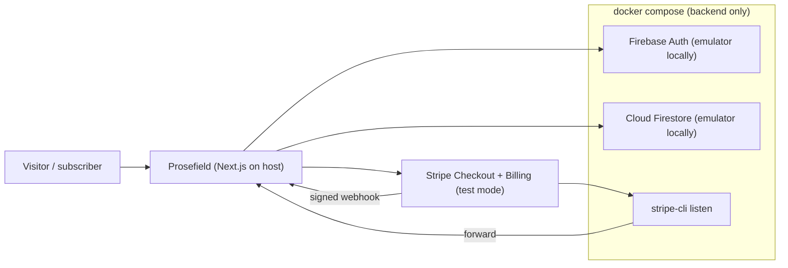
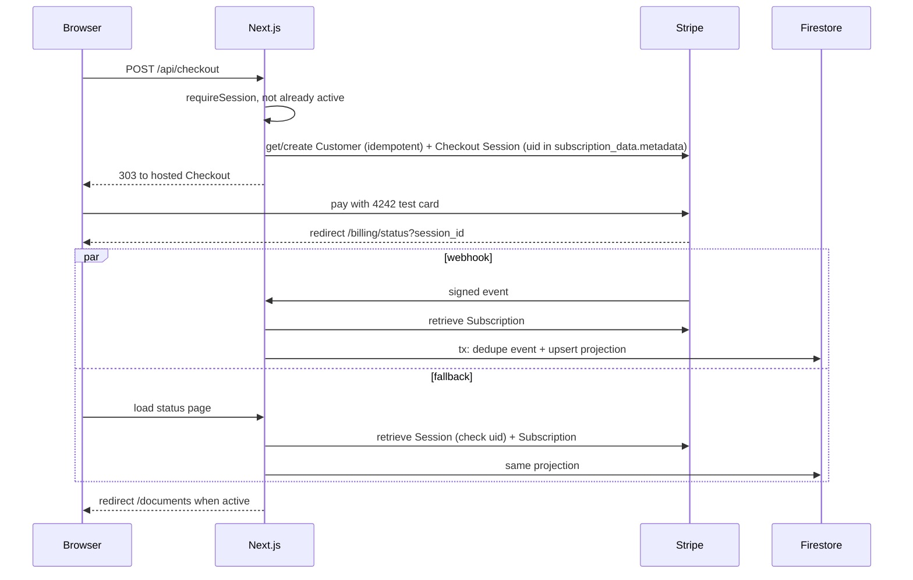
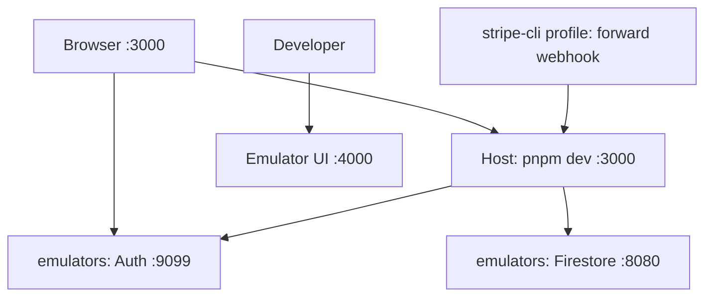

# Prosefield System Architecture v1.0

| Field | Value |
|---|---|
| Status | **Approved v1.0** (approved 2026-10-01 13:43 CEST) |
| Version | v1.0 |
| Date | 2026-10-01 |
| Author | Agent: Engineer Supervisor (from v0.1 by Carlos González Rico) |
| Approver | Carlos González Rico |
| Product | Prosefield |
| Repository | `gassius/prosefield` (public), default branch `main`, baseline `7e041b1` |
| Scope source | Take-Home Assignment doc `2kxv30qk-792` (read-only, never edited) |
| Design source | Art Direction & Design Guide v1.1 (`2kxv30qk-932`), approved; it governs all visual and copy decisions |
| Supersedes | v0.1 (page `2kxv30qk-852`) and its v0.2 review addendum (section 19 there). That page stays unchanged as history |
| Delivery | Implemented only through the **Prosefield Cursor Project**, one ClickUp ticket per phase, draft PRs, Carlos merges |

## 0. Revision history

| Version | Date | Author | Summary |
|---|---|---|---|
| v0.1 | 2026-09-30 | Carlos González Rico | Initial proposal: Next.js + Firebase Auth/Firestore + Stripe Checkout + Tiptap, App Hosting deploy |
| v0.2 | 2026-10-01 | Agent: Engineer Supervisor | Review addendum on the v0.1 page: billing correctness, demo emulator project, Docker option, phasing, open questions |
| v1.0 | 2026-10-01 | Agent: Engineer Supervisor | Consolidated rewrite. Folds in v0.2 and Carlos's answers (local Firebase via Docker as the primary target; deployment entirely on Firebase as an optional final phase; Docker is OK; price and plan configurable; copy owned by the Art Direction guide), aligns with Art Direction v1.1, and makes the Prosefield Cursor Project the delivery vehicle. Changes against v0.1 are listed in section 17 |

## 1. Executive summary

Prosefield is a single full-stack **Next.js 16 (App Router, strict TypeScript)** application with two surfaces:

1. A public, responsive marketing and pricing page, built to the Cultivated Clarity art direction.
2. An authenticated document workspace that only active subscribers can use.

Next.js is both the frontend and the backend-for-frontend. Server code checks Firebase session cookies, does all Firestore access through Firebase Admin, creates Stripe Checkout Sessions, verifies Stripe webhooks, and decides access.

**Primary target: local first.** Host `pnpm dev` for the Next.js frontend; `docker compose up -d --wait` for Firebase Auth and Firestore emulators (project `demo-prosefield`, so no real Firebase project or login is needed) and the Emulator UI. Optional Compose profiles run the app and Stripe CLI webhook forwarder in Docker. The evaluator needs Node per `.nvmrc`, pnpm, Docker, and their own Stripe **test** keys — no host JDK.

**Optional final phase: Firebase for everything.** Firebase App Hosting serves the whole Next.js app (SSR, Route Handlers, the webhook) together with Firebase Auth and Cloud Firestore in one GCP project. There's no Vercel or second host. This is added value only and never blocks the acceptance path.

| Concern | Choice |
|---|---|
| Framework | Next.js 16 App Router, React 19, TypeScript strict |
| Identity | Firebase Authentication (email/password) and server session cookies |
| Data | Cloud Firestore, server-only access through Firebase Admin; browser access denied by rules |
| Local platform | Firebase Local Emulator Suite in Docker, `demo-prosefield` |
| Payments | Stripe Checkout (hosted) in test mode, one recurring price, verified webhooks |
| Editor | Tiptap (JSON persistence, manual save) |
| UI | Tailwind CSS 4 + shadcn/ui (minimal set) + lucide-react, tokens from Art Direction v1.1 |
| Optional deploy | Firebase App Hosting (Cloud Run + CDN + Secret Manager) |

## 2. Architectural drivers

### 2.1 Required capabilities (from the scope doc)
- A landing page with value proposition, CTA, pricing, trust elements, responsive.
- Email/password register, login and logout with **server-validated** sessions, and three visible states (logged out, logged in without a subscription, subscriber).
- Subscriber-only create, edit, save, rename and delete (with confirmation), a list with titles and last-updated times, empty and error states.
- Stripe test subscription, with access granted **only** from server-side webhook confirmation.
- Runs from the README on a fresh machine in under 15 minutes, with `.env.example` and no secrets.
- README (architecture, tradeoffs, Stripe test flow, limitations), a one-page write-up, a 2–4 minute demo, and runnable acceptance tests.
- Effort of 6–10 h, with a hard cap of 12 h.

### 2.2 Quality priorities (in order)
1. A complete end-to-end flow (product completeness carries 30% of the rubric).
2. Correct server-side authorisation and billing (security and correctness, 20%).
3. Readable TypeScript structure with runnable tests (code quality, 25%).
4. Reproducible local setup in under 15 minutes.
5. Faithful Art Direction v1.1 implementation (UX and polish, 15%).
6. Honest, concise documentation (communication, 10%).

### 2.3 Non-goals
AI features; Python or LangChain services; real-time collaboration; autosave and multi-device conflict resolution; version history; uploads and export; an admin UI; email verification; multiple tiers, coupons, taxes or trials; dark mode; production multi-region infrastructure; a public API.

## 3. Current repository assessment

| Area | Current | Decision |
|---|---|---|
| Framework | Next.js 16.3.7 App Router | Keep. Agents must read `node_modules/next/dist/docs/` (AGENTS.md warns of breaking changes). Next 16 uses `proxy.ts` (formerly middleware) and async `cookies()`/`headers()`/`params` |
| React | 19.2.8 | Keep |
| TypeScript | 5, strict | Keep strict |
| Styling | Tailwind 4 | Replace `globals.css` with Art Direction 6.3 tokens, light-only |
| Package manager | pnpm 10.32.1 | pnpm only, pinned through `packageManager` and Corepack |
| Node | `.nvmrc` 24.21.0 | Add `engines.node` `>=24 <25`. Bump `@types/node` to 24 |
| Tests and CI | None | Add Vitest, emulator integration, Playwright + axe, and GitHub Actions |
| Firebase | None | Add `firebase.json`, rules, indexes, and Docker emulators |
| `.env.example` | Absent and ignored | Add it and unignore it explicitly |
| Cloud Agent env | Saved by Carlos (Node 24.21.0, pnpm, `pnpm install --frozen-lockfile`, dev on :3000) | Project agents reuse it. Backend emulators run only via Docker Compose |

## 4. System context



In the optional deployment, the same app runs on Firebase App Hosting against a real Firebase project, with Stripe's hosted webhook pointing at the App Hosting URL.

## 5. Runtime components

### 5.1 Marketing surface
- Built to Art Direction sections 9–11 and 16: header, hero with a **real-HTML, inert** editor preview, assurance strip, three-stage benefits, single-plan pricing, FAQ (3–4 items), and a final CTA.
- Mostly Server Components. Client islands are only the mobile Sheet menu and the Accordion if the primitive needs one.
- **All copy lives in one content module**, `src/content/site.ts` (en-GB), typed, so copy can change without touching components (Carlos's answer 4). Components never hard-code marketing strings.
- **One canonical CTA:** "Start your first page" (Art Direction 10.1). Its destination depends on account state, resolved on the server:

| State | Destination |
|---|---|
| Logged out | `/register?next=/subscribe` |
| Logged in, no active subscription | `/subscribe` |
| Active subscriber | `/documents` |

- `next` is validated against an allow-list of internal paths (open-redirect protection).

### 5.2 Plan and price configuration (Carlos's answer 3)
The price and plan name are configuration, not code.
- `STRIPE_PRICE_ID` is the single source of truth. A server-only `getPlan()` retrieves the Price (with its Product expanded) from Stripe and caches it (`revalidate` about 1 h). It returns `{ name, amount, currency, interval }`, formatted with `Intl.NumberFormat('en-GB')`, for example "€8/month".
- Fallback for when Stripe isn't reachable or the keys aren't set yet (for example, browsing the landing page before configuring Stripe): `PLAN_DISPLAY_NAME`, `PLAN_DISPLAY_PRICE`, `PLAN_DISPLAY_CURRENCY`, `PLAN_DISPLAY_INTERVAL` from env, defaulting to the Art Direction's €8/month.
- Checkout always charges `STRIPE_PRICE_ID`, never a price sent by the client.
- The currency icon follows the configured currency (Art Direction 9.3: Euro or BadgeEuro for EUR).
- A seed script, `pnpm stripe:seed`, creates the test Product and monthly Price in the evaluator's Stripe test account and prints the `STRIPE_PRICE_ID`, so nobody has to set it up by hand in the dashboard.

### 5.3 Authentication
Firebase Auth owns identities and passwords. Prosefield owns the session.
1. The browser registers or signs in with the Firebase Web SDK (persistence `inMemoryPersistence`). Locally it connects to the Auth emulator.
2. The browser POSTs the ID token to `POST /api/session`. The server checks Origin plus a double-submit CSRF token, verifies the ID token, requires a recent `auth_time` (no more than 5 minutes), and creates a session cookie (5 days) via `createSessionCookie`.
3. The cookie is `__session`, HttpOnly, Secure (except on localhost), SameSite=Lax, Path=/. The name `__session` is the only cookie Firebase Hosting/App Hosting forwards to the backend, so the same name works in deployment.
4. The server upserts `users/{uid}` idempotently on the first session.
5. The client signs out of the Firebase SDK, so the server cookie is the only session.
6. Every protected Server Component, Server Action and Route Handler calls `requireSession()`. It runs `verifySessionCookie`, with `checkRevoked: true` for mutations.
7. `DELETE /api/session` clears the cookie and revokes refresh tokens.

Auth form behaviour follows Art Direction 12.7 (labels, aria-describedby, role=alert summary, focus management). Error messages are generic ("Email or password is incorrect").

### 5.4 Billing and entitlement
Stripe owns payment and the subscription lifecycle. Firestore holds a **local entitlement projection**.

**Checkout (`POST /api/checkout`):**
1. `requireSession()`. If the projection is already `active`, the server returns 409 and the UI redirects to `/documents`, so nobody gets a duplicate subscription.
2. Get or create the Stripe Customer **idempotently**: inside a transaction on `users/{uid}`, create with the Idempotency-Key `customer-<uid>` and `metadata.firebaseUid = uid`.
3. Create a Checkout Session with mode `subscription`, `line_items: [{ price: STRIPE_PRICE_ID, quantity: 1 }]`, `customer`, `client_reference_id: uid`, **`subscription_data.metadata.firebaseUid: uid`**, `success_url: APP_URL/billing/status?session_id={CHECKOUT_SESSION_ID}`, and `cancel_url: APP_URL/subscribe`.
4. Redirect the browser to the hosted Checkout URL. No Stripe browser SDK is needed.

**Webhook (`POST /api/stripe/webhook`, `runtime = 'nodejs'`):**
1. Read the raw body with `await req.text()` and run `stripe.webhooks.constructEvent(raw, sig, STRIPE_WEBHOOK_SECRET)`. Return 400 on failure. Never parse JSON first.
2. Handled events: `checkout.session.completed`, `customer.subscription.created`, `customer.subscription.updated`, `customer.subscription.deleted`, `invoice.paid`, `invoice.payment_failed`.
3. Resolve the uid in this order: `subscription.metadata.firebaseUid`, then the session's `client_reference_id`, then the `stripeCustomers/{customerId}` lookup.
4. **Fetch canonical state:** retrieve the Subscription from Stripe and project that snapshot. Event order and `event.created` (one-second resolution) don't matter.
5. In one Firestore transaction: if `stripeEvents/{event.id}` exists, no-op. Otherwise write it and upsert `subscriptions/{uid}`.
6. Return 2xx fast. Unknown event types get 200 and are ignored.

**Delayed webhook fallback (`/billing/status?session_id=…`):** the server retrieves the Checkout Session from Stripe and requires `client_reference_id === uid` and `status === 'complete'`. It then retrieves the Subscription and runs **the same projection function** as the webhook. The Stripe API is the source of truth, so the browser redirect is never trusted. The page also polls a server action every 2 s for up to about 30 s. The copy follows Art Direction 12.5: pending, delayed, and failed with Try again.

**Access policy:** access is granted only when the projection's `status === 'active'`. `cancel_at_period_end` keeps access until Stripe ends the subscription. Every other status (`incomplete`, `incomplete_expired`, `past_due`, `unpaid`, `paused`, `canceled`, `trialing`) is denied. No trial is configured.

**Customer Portal (feature flag `FEATURE_CUSTOMER_PORTAL`, default on if time allows):** `POST /api/billing/portal` creates a portal session for the stored customer. The same flag drives the Art Direction 4.5 copy rule. When it's on: "Cancel anytime" appears in the hero reassurance and pricing, the FAQ gets "Can I cancel at any time?", and the account menu gets "Manage billing". When it's off, none of that renders. The flag is read from the content module, so copy and capability can't drift apart.



### 5.5 Document workspace
- List (sidebar on desktop, sheet or list on mobile) of the owner's documents ordered by `updatedAt` desc, with titles and `<time>` timestamps formatted per Art Direction 12.1 (relative for recent, then "28 September", with the year only when it isn't the current year).
- Create (default title "Untitled document"), rename (inline title, Fraunces display-3), edit, **manual save** (toolbar Save plus Cmd/Ctrl+S, no autosave, no automatic retry), and delete through an AlertDialog (Cancel focused by default, "Delete document" in Destructive, then the toast "Document deleted").
- Save states exactly as in Art Direction 12.3 (Saved, Unsaved changes, Saving…, Save failed. Try again.), using an aria-live region and a `beforeunload` warning when there are unsaved changes.
- Empty state per Art Direction 12.2. The upgrade gate for non-subscribers per 12.4 ("Subscribe to start writing", no disabled editor teaser).
- **Tiptap**, client component, `immediatelyRender: false`. StarterKit is **restricted to the formats the guide shows**: paragraph, H2, H3, bullet and ordered lists, blockquote, bold, italic, history. Code, code block, strike and horizontal rule are disabled. That keeps the toolbar, the landing preview and the pricing benefits truthful. Toolbar toggles expose `aria-pressed` and have tooltips (Art Direction 13.1).
- Persist Tiptap **JSON**. Never render stored HTML.

**Every document mutation is a Server Action with the same guard chain:** `requireSession()`, then `requireActiveSubscription(uid)`, then for an existing document `requireOwner(doc, uid)`, then Zod validation, then a Firestore write with `updatedAt = serverTimestamp()` on success only. Server Actions' built-in Origin check covers CSRF for actions. UI hiding is UX, not security.

### 5.6 Firestore access layer
- The browser never touches Firestore. All reads and writes go through `src/features/*/repository.ts` using Firebase Admin.
- `firestore.rules`: default deny (`allow read, write: if false;`), with emulator rules tests proving it.
- Admin bypasses rules, so the server guard functions are the security boundary and are unit- and integration-tested.

## 6. Routes

| Route | Access | Purpose |
|---|---|---|
| `/` | Public | Landing |
| `/login`, `/register` | Public (redirect if signed in) | Auth; `next` allow-listed |
| `/subscribe` | Session | Plan summary + "Continue to secure checkout" |
| `/billing/status` | Session | Pending, confirmed or failed, plus the server-verified session sync |
| `/documents` | Session + active | List and empty state |
| `/documents/[documentId]` | Session + active + owner | Editor (404, not 403, for other users' docs) |
| `POST/DELETE /api/session` | ID token or session | Establish or clear the session |
| `POST /api/checkout` | Session, not active | Create the Checkout Session |
| `POST /api/billing/portal` | Session + customer (flagged) | Customer Portal |
| `POST /api/stripe/webhook` | Stripe signature | Update the projection |
| `GET /api/health` | Public | Liveness check for compose and the deploy |

Layout-level redirects improve UX only. Each action and handler authorises on its own.

## 7. Source organisation

```text
src/
  app/
    (marketing)/page.tsx
    (auth)/login/page.tsx, register/page.tsx
    (account)/subscribe/page.tsx, billing/status/page.tsx
    (workspace)/documents/page.tsx, documents/[documentId]/page.tsx
    api/session/route.ts, checkout/route.ts, billing/portal/route.ts,
        stripe/webhook/route.ts, health/route.ts
    layout.tsx (fonts, lang="en-GB", skip link), globals.css (Art Direction 6.3)
  components/
    brand/prosefield-logo.tsx (hand-authored SVG, variants per Art Direction 5.3)
    marketing/ (site-header, hero, editor-preview, assurance-strip, benefits, pricing, faq, final-cta, site-footer)
    editor/ (editor, toolbar, save-status)
    ui/ (shadcn components, only those listed in Art Direction 14)
  content/site.ts (all marketing and app copy, en-GB, feature-flag aware)
  features/
    auth/ (session.ts, guards.ts, csrf.ts)
    billing/ (plan.ts, checkout.ts, projection.ts, webhook.ts, entitlement.ts)
    documents/ (actions.ts, schemas.ts, repository.ts, format-time.ts)
  lib/ (env.ts with Zod, firebase/admin.ts, client.ts, stripe/server.ts) all with "server-only" where applicable
tests/ unit/, integration/, e2e/
docker/ (emulators.Dockerfile)
docker-compose.yml, firebase.json, .firebaserc, firestore.rules, firestore.indexes.json,
apphosting.yaml (P6), .env.example, docs/ (architecture.md, art-direction.md, write-up.md)
```

## 8. Firestore data model

| Collection | ID | Fields |
|---|---|---|
| `users` | uid | `email`, `stripeCustomerId \| null`, `createdAt`, `updatedAt` |
| `stripeCustomers` | Stripe customer id | `uid`, `createdAt` (reverse lookup) |
| `subscriptions` | uid | `stripeCustomerId`, `stripeSubscriptionId`, `stripePriceId`, `status`, `currentPeriodEnd`, `cancelAtPeriodEnd`, `updatedAt`, `lastEventId` (diagnostics) |
| `documents` | auto | `ownerId` (immutable), `title` (trimmed, 1–120 chars), `content` (Tiptap JSON, serialised ≤ 512 KB, under Firestore's 1 MiB limit), `createdAt`, `updatedAt` |
| `stripeEvents` | Stripe event id | `type`, `created`, `processedAt` |

Composite index: `documents(ownerId ASC, updatedAt DESC)`, committed in `firestore.indexes.json`.

## 9. Security architecture

**Trust boundaries:** browser input, ID tokens, session cookies, webhook bodies, URL parameters (`session_id`, `next`, document IDs) and client-side state are all untrusted until verified on the server. Only metadata created by Prosefield's server is trusted.

| Risk | Control |
|---|---|
| Client-only gating | Guard chain in every action and handler |
| Session theft | HttpOnly/Secure/SameSite `__session`, 5-day lifetime, revocation check on mutations, revoke on logout |
| CSRF | SameSite cookie + Origin check + double-submit token on `/api/session`, and Next's built-in action Origin check |
| Cross-user access | `ownerId === uid`; returns 404 otherwise |
| Forged payment success | Access only from the projection, written by verified webhook or Stripe-API-verified session sync |
| Webhook forgery and replay | Raw-body signature verification; transactional `stripeEvents` dedupe |
| Out-of-order events | Always project the retrieved Subscription |
| Duplicate customers or subscriptions | Idempotent customer creation; checkout refused when active |
| Open redirect | `next` allow-list |
| XSS | Tiptap JSON only; no `dangerouslySetInnerHTML` of user content |
| Oversized input | Zod bounds (title, JSON size) |
| Direct DB access | Default-deny rules, tested |
| Secret leakage (public repo) | `.env*` ignored except `.env.example`; gitleaks in CI; no `NEXT_PUBLIC_` secrets; App Hosting secrets in P6 |
| Tests reaching production | `demo-` project ID with explicit emulator hosts; tests refuse to run without emulator env vars |
| Log leakage | Structured logs with request and event IDs only; never tokens, cookies, passwords, document bodies or keys |

### 9.1 Configuration classes (`.env.example`)
- **Public:** `NEXT_PUBLIC_FIREBASE_API_KEY` (any non-empty value locally), `NEXT_PUBLIC_FIREBASE_AUTH_DOMAIN`, `NEXT_PUBLIC_FIREBASE_PROJECT_ID=demo-prosefield`, `NEXT_PUBLIC_FIREBASE_APP_ID`, `NEXT_PUBLIC_FIREBASE_AUTH_EMULATOR_HOST=localhost:9099`.
- **Server:** `APP_URL`, `FIREBASE_PROJECT_ID=demo-prosefield`, `STRIPE_SECRET_KEY` (sk_test_ only; `env.ts` rejects live keys), `STRIPE_WEBHOOK_SECRET`, `STRIPE_PRICE_ID`, `FEATURE_CUSTOMER_PORTAL`.
- **Plan display fallback:** `PLAN_DISPLAY_NAME`, `PLAN_DISPLAY_PRICE`, `PLAN_DISPLAY_CURRENCY`, `PLAN_DISPLAY_INTERVAL`.
- **Emulators:** `FIREBASE_AUTH_EMULATOR_HOST`, `FIRESTORE_EMULATOR_HOST` (set by compose).

## 10. Local development (primary target)



**`docker-compose.yml` services:**
- `emulators` (default): image from `docker/emulators.Dockerfile` (`eclipse-temurin` JRE + Node + pinned `firebase-tools` inside the image only). Entrypoint is `docker/emulators-entrypoint.sh` (Auth, Firestore, UI for `demo-prosefield`, import/export via the `emulator-data` named volume). Ports 9099, 8080 and 4000 bind to `127.0.0.1`. Healthcheck + `stop_grace_period: 60s` for export-on-exit.
- `app` (profile `app`): optional Next.js in Docker. Default workflow runs the frontend on the host with `pnpm dev` so Compose does not own `:3000`.
- `stripe-cli` (profile `stripe`): the `stripe/stripe-cli` image running `listen --forward-to app:3000/api/stripe/webhook` (needs the `app` profile).

**Host requirements:** nvm (recommended; `nvm use` at repo root), Node per `.nvmrc`, pnpm (Corepack), Docker + Compose for the backend. No host JDK and no global `firebase-tools`.

**README quick start (target under 10 minutes, measured once on a clean machine and recorded):**
1. Prerequisites above. A Stripe test account is free.
2. `cp .env.example .env`, then paste `STRIPE_SECRET_KEY` (sk_test_).
3. `pnpm install && pnpm dev` — frontend on http://localhost:3000 (works with backend down).
4. `docker compose up -d --wait` — Emulator UI on :4000.
5. Optional: `docker compose run --rm stripe-cli listen --print-secret` for `STRIPE_WEBHOOK_SECRET`, then `--profile stripe` (with `--profile app` if the CLI must reach the containerised app).

## 11. Deployment: Firebase for everything (optional phase P6)

Carlos's answer 1: deploy only at the end and only if it's easy. One platform for everything is preferred.

- **Firebase App Hosting** serves the entire Next.js app: SSR pages, Server Actions, Route Handlers and the Stripe webhook. There's no Vercel and no separate static host. Rollouts happen automatically from `main`.
- **Firebase Auth + Cloud Firestore** live in the same Firebase project (EU region, chosen before any data is created). `firestore.rules` and indexes are deployed with `firebase deploy --only firestore`.
- **Secrets:** `STRIPE_SECRET_KEY` and `STRIPE_WEBHOOK_SECRET` go in App Hosting secrets (Secret Manager) via `apphosting.yaml`. Firebase Admin uses the App Hosting service account (no key files).
- Stripe's test-mode hosted webhook points at `https://<backend>.web.app/api/stripe/webhook`. The App Hosting domain is added to Auth authorised domains.
- **Cost:** App Hosting needs the Blaze plan; the free allowances should cover this traffic. A budget alert of about €5 goes on before the first rollout, with min instances at 0.
- **Exit criteria:** the same Playwright smoke test (landing, register, upgrade gate) passes against the deployed URL, plus one manual Stripe test payment. If setup goes past about 1.5 h, stop and document it under "With another day".
- This scope accepts the trade-off that App Hosting has no PR preview channels.

## 12. Dependencies

Versions get pinned through `pnpm-lock.yaml` at install time.
- **Runtime:** `firebase`, `firebase-admin`, `server-only`, `stripe`, `zod`, `@tiptap/react`, `@tiptap/pm`, `@tiptap/starter-kit`, `@tiptap/extension-placeholder`, `lucide-react`, `sonner`, and shadcn utilities (`class-variance-authority`, `clsx`, `tailwind-merge`, plus only the primitives the selected components need). Fonts come through `next/font/google` (Fraunces variable with opsz, and DM Sans).
- **Development:** `@firebase/rules-unit-testing`, `vitest`, `@vitest/coverage-v8`, `@playwright/test`, `@axe-core/playwright`, `tsx` for scripts. (`firebase-tools` lives only inside `docker/emulators.Dockerfile`, not on the host.)
- **CI only:** `gitleaks` (action), `actionlint`.
- **Not used:** Stripe.js, SaaS starters, animation or carousel packages, Vercel packages.

## 13. Verification strategy

| Layer | What | Where |
|---|---|---|
| Static | `pnpm lint`, `pnpm typecheck`, `pnpm build`, actionlint, strict YAML, `docker compose config -q`, gitleaks | CI on every PR |
| Unit (Vitest) | Status-to-entitlement mapping, projection from a Subscription snapshot, uid resolution order, webhook signature (via `generateTestHeaderString`), Zod schemas, `next` allow-list, time formatting (en-GB), `getPlan` fallback | CI |
| Integration (Docker emulators) | Session exchange and rejection cases; guard chain (non-subscriber denied for every mutation; subscriber full CRUD; user A can't reach B's doc, 404); duplicate event ignored; rules deny client access | CI (Compose emulators service) |
| Acceptance (Playwright + axe) | Landing at 375, 768, 1024 and 1440 px with no horizontal overflow; one h1; the CTA destination per state; register, login, logout; upgrade gate; seeded-subscriber CRUD + save states + Ctrl+S + delete dialog + persistence across logout and login; axe has no serious or critical violations | CI (cached browsers); local optional |
| Manual | Full Stripe flow with 4242 4242 4242 4242 via the stripe-cli service; delayed-webhook path (stop stripe-cli, pay, check the session-sync fallback); cancel via the Portal if flagged | README + demo |

The seeded subscriber is written straight into the emulator projection by a test fixture. That's documented as a test-only shortcut, and no production code path allows it.

## 14. Delivery plan via the Prosefield Cursor Project

All implementation runs through the **Prosefield Cursor Project** (coordinator `bc-cb8c7a99-09da-4b74-b273-fbbf6130fef1`). The scope doc (read-only), Art Direction v1.1 and this architecture (once approved) live in the Project's shared context. P0 also commits them under `docs/`, so every thread, the README and reviewers see the same source. Each phase is one ClickUp ticket on the Prosefield board and one draft PR, reviewed by Pull Request Reviewer. Carlos merges. Commits carry the GasNet trailer block (`Agent`, `Agent-Ticket`, `Agent-Run`) and PR bodies carry the same footer.

| Phase | Est. | Deliverable | Done when |
|---|---|---|---|
| P0 Foundation | 1 h | Tokens and fonts (Art Direction 6.3, 7.1), `lang="en-GB"`, light-only; `env.ts`; docker compose emulators + app; `firebase.json`, rules, indexes; Vitest; CI (lint, typecheck, build, unit, gitleaks, actionlint); `.env.example`; `docs/` | `docker compose up` serves the app with emulators healthy; CI green |
| P1 Auth | 1.5 h | Register, login, logout, session cookie, CSRF, guards, account-state header and CTA routing, auth error UX | Integration tests for the session and guards pass |
| P2 Billing | 2 h | `getPlan`, `stripe:seed`, checkout, webhook, projection, session-sync fallback, billing status page, upgrade gate | Unit and integration tests pass, and a manual 4242 flow unlocks access |
| P3 Documents | 2 h | Repository, actions, list, empty state, Tiptap editor (restricted formats), save states, rename, delete dialog | Guard-chain integration tests pass, and CRUD persists |
| P4 Landing | 1.5 h | All marketing sections from `content/site.ts`, inert preview, logo SVG and favicon, responsive pass | Playwright plus axe at four widths green |
| P5 Ship docs | 1 h | Playwright happy path, README (architecture, tradeoffs, Stripe flow, limitations, AI usage and manual verification, credits), write-up (three questions), demo recording, time log | A fresh-machine run under 15 min is measured and recorded |
| P6 Optional | ≤ 1.5 h | Customer Portal (flag on) + Firebase App Hosting deploy | Smoke test on the deployed URL |

The total for P0–P5 is about 9 h, inside the 6–10 h estimate, leaving about 3 h of buffer under the 12 h cap for review rounds and P6.

## 15. Operational notes
- Structured logs with request and event IDs. Never log secrets, tokens, cookies, passwords or document bodies.
- Keep `stripeEvents` for debugging.
- Emulator data persists in the Compose named volume `emulator-data` (also mirrored under git-ignored `.emulator-data/` in the container). Wipe with `docker compose down -v`.
- P6: budget alert, min instances 0, rollback through App Hosting rollout history.

## 16. Key decisions and trade-offs

| Decision | Benefit | Trade-off |
|---|---|---|
| One Next.js app | Small system, shared types, one origin | Backend deploys with the frontend |
| Docker-only local Firebase (`demo-` project) | The evaluator needs no Firebase account and no host JDK; can't touch production | Docker is a prerequisite for the backend; first image pull time |
| Firebase for everything (optional) | One platform, one bill, one console; no Vercel | Blaze plan; no PR previews |
| Session cookie (`__session`) | Server-validated sessions as required; App Hosting compatible | Token exchange + CSRF handling |
| Server-only Firestore | Authorisation in one tested layer; deny-all rules | No real-time or offline client features |
| Fetch canonical Subscription on every event | Order-independent, simple, correct | One extra Stripe API call per event |
| Session-sync fallback on the status page | Fast unlock even when webhooks are delayed; strong write-up answer | Small amount of extra code (shares the projection function) |
| Price from `STRIPE_PRICE_ID` | Price and plan editable without code changes | Landing depends on Stripe at render (cached, with env fallback) |
| Copy in `content/site.ts` | Content can change freely without component edits | One more indirection |
| Feature-flagged Portal tied to copy | Honest "Cancel anytime" rule enforced by code | Flag must be kept in sync in docs |
| Restricted Tiptap formats | Truthful toolbar, preview and pricing | Fewer formats |
| Manual save | Explicit, testable, matches the Art Direction | Less seamless than autosave |
| shadcn/ui minimal set | Fast polish, code visible | Generated code needs review |

## 17. Changes from v0.1 (for approval)
1. **Local-first with Docker** is now the primary target (`docker compose`, `demo-prosefield`, a stripe-cli service). Deployment moves to optional phase P6, specified as Firebase for everything (App Hosting + Auth + Firestore, no Vercel).
2. **Billing correctness:** uid in `subscription_data.metadata` and Customer metadata, a `stripeCustomers` reverse lookup, canonical Subscription fetch replacing `lastStripeEventCreated` ordering, idempotent Customer creation, checkout refused when already active, and the Node runtime with raw-body verification made explicit.
3. **Delayed-webhook fallback** via server-verified Checkout Session retrieval on `/billing/status`.
4. **Configurable plan and price** (`STRIPE_PRICE_ID` + `getPlan()` + env display fallback + `stripe:seed`).
5. **Content module** for all copy; CTA and copy rules delegated to Art Direction v1.1 ("Start your first page"; no trial; the "Cancel anytime" rule enforced through `FEATURE_CUSTOMER_PORTAL`).
6. **Art Direction v1.1 alignment:** tokens, fonts, en-GB, light-only, restricted editor formats, save-state, billing-pending, upgrade-gate, delete and auth-error patterns, a11y rules, and axe in the acceptance tests.
7. **Security additions:** `next` allow-list, `__session` cookie name, recent-auth check, revocation on logout, 404 for foreign docs, gitleaks for the public repo, live-key rejection, payload bounds sized to Firestore limits.
8. **Phased delivery plan** sized to the time budget, run through the Prosefield Cursor Project with docs committed under `docs/`.
9. Deliverables added to the definition of done: write-up, demo, time log, AI-usage section, credits.

## 18. Definition of done (first release)
- Landing communicates the product and the configured price, per Art Direction v1.1, at four widths.
- Register, login and logout work with server-validated sessions; all three states are visible.
- Non-subscribers can't create or edit (server-enforced) and see the upgrade path.
- A Stripe test payment unlocks access via the verified webhook, or the Stripe-verified session sync.
- A subscriber can create, edit, save, rename and delete; documents persist across logout and login.
- `docker compose` quick start works on a fresh machine in under 15 min (measured).
- Unit, emulator integration and Playwright + axe suites pass in CI. No secrets are in the repo or its history.
- README, write-up, demo and time log are delivered.
- Optional: Firebase App Hosting serves the full flow.

## 19. Open items (non-blocking)
- A final logo replaces the provisional cultivated-P (Art Direction 5.1). The component API stays the same.
- Final price and plan name: set via Stripe and env at any time, no code change needed.
- Customer Portal: default on in P6 if time allows; the copy follows automatically.
