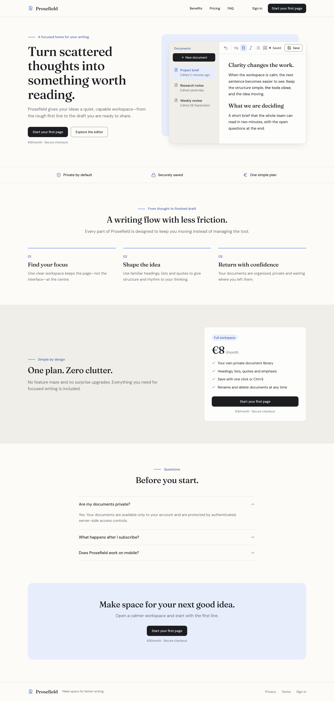
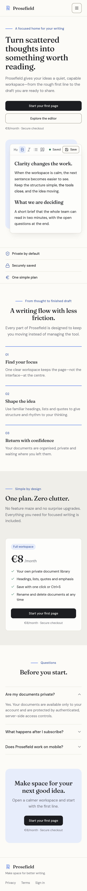
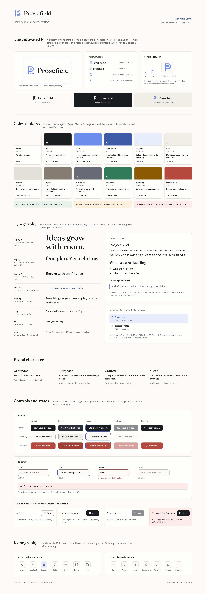

<!-- Art Direction & Design Guide v1.1 (Approved). Reference images are bundled under art-direction/: prosefield-landing-v1.1.png, prosefield-landing-mobile-v1.1.png, prosefield-branding-v1.1.png -->
# Prosefield Art Direction and Design Guide

| Field | Value |
| ---| --- |
| Direction | Cultivated Clarity |
| Version | v1.1 |
| Status | Approved v1.1 |
| Date | 2026-10-01 |
| Owner | Carlos González Rico |
| Approver | Carlos González Rico |
| Product | Prosefield |
| Scope | Landing experience, conversion funnel, essential application states, and shared product identity |

Supersedes Art Direction & Design Guide v1.0.

## 1. Purpose

This guide translates the approved **Cultivated Clarity** direction into practical rules for implementing Prosefield with Next.js, Tailwind CSS 4, and shadcn/ui.

It is a focused implementation contract for this product, not a complete corporate identity system. Its purpose is to make the marketing experience distinctive, coherent, responsive, and conversion-oriented, and to give the essential application states a consistent treatment, without spending the project budget on unnecessary design-system work.

## 2. Direction summary

Prosefield should feel like a thoughtfully made writing instrument: calm enough to support concentration, but purposeful enough to move the user toward action.

The direction combines:

*   Editorial typography and generous negative space.
*   A recognisable custom “cultivated P” mark.
*   Dark, decisive conversion controls.
*   A restrained field-blue accent for identity and navigation.
*   Warm neutral surfaces instead of clinical pure-white SaaS styling.
*   Outcome-oriented language centred on starting, shaping, and finishing writing.

The visual idea is **cultivation** rather than automation. A draft develops when it has the right conditions: space, structure, and continued attention. This connects naturally to the name Prosefield without relying on literal landscape imagery.

## 3. Reference designs

Status: Approved reference images v1.1 (2026-10-01).

### 3.1 Landing page, desktop



Full landing page at 1440 px (rendered at 2×), following the section order in section 9.

### 3.2 Landing page, mobile



Landing page at 390 px (rendered at 2×), following the mobile rules in section 16.

### 3.3 Branding board



Logo and minimum sizes, colour tokens with contrast, type scale, brand character, control states, manual-save states, and icon sizes.

The cultivated-P mark shown in these images is a provisional mark pending the final logo.

The images communicate hierarchy, composition, and tone; they are not pixel-perfect specifications. Where an image and this guide disagree, the guide wins. Content accuracy, accessibility, and responsive behaviour take precedence over reproducing every measurement exactly.

## 4. Brand foundations

### 4.1 Positioning

**Prosefield is a focused writing workspace that helps professionals turn scattered thoughts into clear, finished documents.**

It should not present itself as:

*   An AI writing assistant.
*   A general-purpose project-management platform.
*   A collaboration suite.
*   A replacement for every document product.
*   A productivity system built around pressure or streaks.

The product does not include AI features, so the brand and landing page must not imply capabilities it does not have.

### 4.2 Brand promise

> Make space for better writing.

This is the preferred brand line. It works as a footer signature, metadata description, or supporting campaign line. The hero should use a more concrete outcome-focused message.

The GitHub repository description and the site metadata description should use this line.

### 4.3 Brand character

| Trait | Meaning in practice | Avoid |
| ---| ---| --- |
| Grounded | Warm, confident, and useful | Sleepy, rustic, sentimental |
| Purposeful | Every section advances understanding or action | Decorative filler and vague claims |
| Crafted | Typography and details feel intentionally composed | Generic template styling |
| Clear | Short sentences and concrete product language | Technical jargon and inflated promises |

### 4.4 Voice principles

*   Address the reader directly.
*   Prefer active verbs: write, shape, save, return, finish.
*   Explain outcomes before features.
*   Keep headings short and rhythmic.
*   Use calm confidence rather than urgency or fear of missing out.
*   Avoid “revolutionary,” “effortless,” “10×,” and other unsupported claims.
*   Do not describe security as absolute. Say documents are protected by authenticated, server-side access controls.
*   Use British English (en-GB) spelling throughout the product and documentation: colour, centre, organised, behaviour.

### 4.5 Release-copy rule: cancellation

Do not use “Cancel anytime” in the hero, pricing, or FAQ unless the Stripe Customer Portal is explicitly committed for the release.

If the Customer Portal fits the schedule, restore the claim in the hero reassurance and pricing card, add the FAQ question “Can I cancel at any time?”, and add a `Manage billing` entry to the account menu.

## 5. Logo system

### 5.1 The cultivated P

The brand mark is a custom letter **P** combining three ideas:

1. The vertical silhouette of a page or writing surface.
2. Horizontal strokes that suggest lines of prose.
3. Curved lower strokes that resemble cultivated field rows.

This should be implemented as a small, hand-authored SVG React component rather than sourced from an icon library. Lucide remains appropriate for interface icons, but not for the product identity.

The mark drawn in the v1.1 reference images is provisional, pending the final logo.

### 5.2 Lockup and typography

*   Wordmark: `Prosefield` set in Fraunces 500.
*   The custom cultivated-P symbol sits to the left of the wordmark.
*   Navigation and other interface text beside the lockup use DM Sans 500.
*   Verify legibility of both the mark and the wordmark at the actual header size on a standard-density screen before finalising.

### 5.3 Logo variants

Implement only the variants needed for this product:

*   Full horizontal lockup: mark plus `Prosefield` wordmark.
*   Mark only: small mobile surfaces and loading state.
*   Simplified favicon: keeps the P silhouette and two prose lines, drops the curved field-row strokes. Export at 16, 32, and 180 px (Apple touch icon).
*   Single-colour dark version.
*   Single-colour light version.
*   Field-blue version on light neutral backgrounds.

Do not create gradient, outlined badge, or illustrated variants in this scope.

### 5.4 Minimum sizes

| Use | Minimum |
| ---| --- |
| Full lockup in header and footer | Mark 24 px tall; wordmark 18 px font size |
| Full lockup, absolute minimum | Mark 20 px tall; wordmark 16 px font size |
| Detailed mark alone | 24 px |
| Below 24 px | Use the simplified favicon mark |

### 5.5 Usage rules

*   Preserve clear space equal to roughly one third of the mark width.
*   Do not place the mark inside a generic rounded-square app-icon container on the landing page.
*   Do not add shadows, gradients, rotations, or animation.
*   Keep the mark and wordmark optically aligned rather than mechanically centred.
*   Use the full lockup in the header and footer.
*   Use the mark alone only when the wordmark is already present or the product identity is obvious.
*   Match the mark's stroke weight to Lucide icons at the same size.

## 6. Colour system

Cultivated Clarity uses warm neutrals for reading comfort, near-black for conversion controls, and field blue for brand recognition. Contrast ratios are measured against Paper unless stated.

| Token | Value | Role | Contrast |
| ---| ---| ---| --- |
| Paper | `#FCFBF7` | Page background | — |
| Ink | `#1B1D21` | Primary text and all primary buttons | 16.3:1 |
| Field | `#6C8EEA` | Brand mark, decorative lines, large text only | 3.0:1 |
| Field deep | `#405CA8` | Small coloured text, links, focus ring | 6.1:1 |
| Growth | `#E8EDFC` | Soft highlight, selected surfaces, preview backdrop | — |
| Soil | `#F0EEE8` | Muted surfaces and alternate sections | — |
| Border | `#E3E0D8` | Decorative separators only | 1.3:1 |
| Input | `#857F73` | Form-field and control boundaries | 3.8:1 |
| Muted ink | `#686B73` | Secondary copy and metadata | 5.2:1 |
| Success | `#327A57` | Saved and payment-confirmed states | 5.0:1 |
| Warning | `#8A5A00` | Unsaved changes and pending states | 5.7:1 |
| Destructive | `#B5473C` | Delete and actionable errors only | 5.2:1 |

Soft state backgrounds: Success soft `#E7F2EC`, Warning soft `#FBF0DC`, Destructive soft `#FBEAE7`. Use them with Ink text and a state-coloured icon; do not set body text in the state colour on a soft background.

### 6.1 Colour behaviour

*   Primary CTA buttons use **Ink**, not Field, to create a decisive visual anchor.
*   Field is a brand accent, not the default colour for every interactive element.
*   Use Field only for large text (24 px and above, or 18.66 px bold) and decorative graphics. Use Field deep for all small coloured text. Never place Field text on Growth.
*   Use Growth for large, low-contrast background shapes and selected surfaces.
*   Keep most of the page Paper. Alternate backgrounds should be used sparingly.
*   Error, success, and warning colours communicate state and must not be used decoratively.
*   v1 is light-only. Remove the create-next-app `prefers-color-scheme: dark` block and declare `color-scheme: light`. A dark theme is out of scope; the semantic tokens allow it to be added later.

### 6.2 Interactive states

| State | Treatment |
| ---| --- |
| Secondary button (default) | Paper background, 1 px Input border, Ink text. |
| Hover | Ink buttons lighten to `#2A2D33`; secondary buttons gain a Soil background; destructive buttons darken to `#A13F35` (Paper text 6.2:1). A 1 px translate is allowed; no scaling. |
| Focus | 2 px ring in Field deep with a 2 px Paper offset on every interactive element (`focus-visible:ring-2 ring-ring ring-offset-2 ring-offset-background`). The offset is required: Field deep directly against Ink is only 2.7:1. |
| Disabled | 50% opacity and `cursor-not-allowed`; keep the label visible so the state is not communicated by colour alone. |
| Loading | Keep the button width, show a spinner with a text label (for example `Saving…`), and set `aria-busy="true"`. |

### 6.3 Tailwind 4 token configuration

The repository uses Tailwind CSS 4 with sources under `src/`. Define tokens as full colour values in `src/app/globals.css` and expose them to utilities with `@theme inline`. This replaces the create-next-app defaults, including the dark-mode block.

```css
@import "tailwindcss";

:root {
  color-scheme: light;

  --background: #FCFBF7;        /* Paper */
  --foreground: #1B1D21;        /* Ink */
  --card: #FDFDFC;
  --card-foreground: #1B1D21;
  --primary: #1B1D21;           /* Ink: all primary CTAs */
  --primary-foreground: #FCFBF7;
  --secondary: #F0EEE8;         /* Soil */
  --secondary-foreground: #1B1D21;
  --muted: #F0EEE8;
  --muted-foreground: #686B73;  /* Muted ink */
  --accent: #E8EDFC;            /* Growth (single pale blue token) */
  --accent-foreground: #405CA8;
  --border: #E3E0D8;            /* decorative separators only */
  --input: #857F73;             /* control boundaries, 3.8:1 */
  --ring: #405CA8;              /* always with a 2px Paper offset */

  --brand: #6C8EEA;             /* Field: large and decorative only */
  --brand-deep: #405CA8;        /* Field deep: small coloured text */

  --success: #327A57;
  --success-soft: #E7F2EC;
  --warning: #8A5A00;
  --warning-soft: #FBF0DC;
  --destructive: #B5473C;
  --destructive-foreground: #FCFBF7;
  --destructive-soft: #FBEAE7;

  --radius: 0.75rem;
}

@theme inline {
  --color-background: var(--background);
  --color-foreground: var(--foreground);
  --color-card: var(--card);
  --color-card-foreground: var(--card-foreground);
  --color-primary: var(--primary);
  --color-primary-foreground: var(--primary-foreground);
  --color-secondary: var(--secondary);
  --color-secondary-foreground: var(--secondary-foreground);
  --color-muted: var(--muted);
  --color-muted-foreground: var(--muted-foreground);
  --color-accent: var(--accent);
  --color-accent-foreground: var(--accent-foreground);
  --color-border: var(--border);
  --color-input: var(--input);
  --color-ring: var(--ring);
  --color-brand: var(--brand);
  --color-brand-deep: var(--brand-deep);
  --color-success: var(--success);
  --color-success-soft: var(--success-soft);
  --color-warning: var(--warning);
  --color-warning-soft: var(--warning-soft);
  --color-destructive: var(--destructive);
  --color-destructive-foreground: var(--destructive-foreground);
  --color-destructive-soft: var(--destructive-soft);
  --radius-lg: var(--radius);
  --radius-md: calc(var(--radius) - 2px);
  --font-sans: var(--font-dm-sans);
  --font-display: var(--font-fraunces);
  --ease-standard: cubic-bezier(0.2, 0, 0, 1);
}

body {
  background: var(--background);
  color: var(--foreground);
  font-family: var(--font-dm-sans), system-ui, sans-serif;
}
```

Values may be adjusted slightly after checking them in the browser. Preserve the role and contrast relationship even if the exact colour changes.

## 7. Typography

### 7.1 Typeface roles

| Role | Typeface | Weight | Usage |
| ---| ---| ---| --- |
| Display | Fraunces (variable) | 500 | Hero, section headings, pricing emphasis, wordmark, editor headings |
| Interface | DM Sans | 500 | Navigation, buttons, labels, document titles |
| Body | DM Sans | 400 | Paragraphs, descriptions, form help, editor body |

Load both families through `next/font/google` so Next.js handles optimisation and avoids layout shift. Load Fraunces as a variable font with the optical-size axis and set the weight in CSS. The font variables (`--font-dm-sans`, `--font-fraunces`) are mapped to the Tailwind `font-sans` and `font-display` utilities in 6.3. No additional font package is required.

```ts
import { DM_Sans, Fraunces } from "next/font/google";

export const sans = DM_Sans({
  subsets: ["latin"],
  variable: "--font-dm-sans",
});

export const display = Fraunces({
  subsets: ["latin"],
  variable: "--font-fraunces",
  axes: ["opsz"],
});
```

### 7.2 Type scale

| Token | Face and weight | Size (mobile → desktop) | Line height | Use |
| ---| ---| ---| ---| --- |
| display-1 | Fraunces 500 | 36 → 56 px | 1.1 | Hero `h1` only |
| display-2 | Fraunces 500 | 28 → 36 px | 1.15 | Section `h2` |
| display-3 | Fraunces 500 | 20 → 24 px | 1.25 | Card and benefit `h3`, pricing value |
| eyebrow | DM Sans 500, Field deep | 13 → 14 px, tracking 0.02em | 1.4 | Section labels |
| body-lg | DM Sans 400 | 17 → 18 px | 1.6 | Marketing paragraphs |
| body | DM Sans 400 | 15 → 16 px | 1.6 | Application UI and forms |
| label | DM Sans 500 | 14 px | 1.4 | Buttons, navigation, form labels, document titles in lists |
| meta | DM Sans 400, Muted ink | 13 px | 1.4 | Timestamps, reassurance line, help text |

Never set text below 13 px.

### 7.3 Editor text styles

| Element | Style |
| ---| --- |
| Paragraph | DM Sans 400, 17 px, line height 1.7, maximum width 68 characters |
| Heading 2 | Fraunces 500, 26 px, line height 1.25, 32 px space above |
| Heading 3 | Fraunces 500, 20 px, line height 1.3, 24 px space above |
| Lists | Body size, 24 px indent, 4 px between items |
| Blockquote | 2 px Field left rule, 16 px left padding, Muted ink, no italics |
| Bold | DM Sans 500 (the guide uses regular and medium weights only) |
| Italic | DM Sans italic, used only where the writer applies it |
| Document title | Fraunces 500, display-3 size |

### 7.4 Type rules

*   Use Fraunces only for expressive headings, the wordmark, editor headings, and selected pricing values.
*   Do not use the display face for form labels, buttons, navigation, or editor controls.
*   Use only regular and medium weights.
*   Keep paragraph width between approximately 55 and 70 characters.
*   Avoid all-caps paragraphs. Compact eyebrow labels may use uppercase or tracked text sparingly.
*   Use sentence case throughout the interface.

## 8. Layout and spatial system

### 8.1 Container

*   Maximum marketing-content width: `1200px`.
*   Standard horizontal padding: `24px` mobile, `32px` tablet, `48px` desktop.
*   Long-form text column: approximately `640px`.
*   Use generous section spacing, but keep the conversion route visible without excessive scrolling.

### 8.2 Spacing

Use Tailwind's default 4 px spacing scale. Prefer these steps:

*   Tight control spacing: `2`, `3`.
*   Component spacing: `4`, `6`.
*   Card and section internal padding: `6`, `8`.
*   Section separation: `16`, `20`, `24`.

Avoid one-off values unless optical alignment genuinely requires them. Leave at least `6` between supporting copy and a CTA. When a section heading is centred, centre its eyebrow too.

### 8.3 Shape and elevation

*   Use a moderate radius: approximately 12 px for cards and large surfaces.
*   Buttons may use the same radius or a slightly smaller 10 px radius.
*   Use borders and tonal changes before shadows.
*   Reserve a subtle shadow for the product preview or floating checkout state.
*   Do not use glassmorphism, high-gloss effects, or large blurred gradient blobs.

## 9. Landing-page composition

Implement the page in this order.

### 9.1 Header

Content:

*   Full Prosefield lockup.
*   Links to benefits, pricing, and FAQ.
*   `Sign in` secondary action.
*   Compact primary action: `Start your first page`.

Behaviour:

*   Keep the header visually light and separated by a quiet bottom border.
*   Collapse links into a shadcn `Sheet` menu on small screens.
*   Do not make the header sticky unless testing shows a clear conversion benefit.
*   Below `640px`, the header shows only the lockup and the menu button; `Sign in` and the header CTA move into the menu `Sheet`. The hero CTA sits directly below.

### 9.2 Hero

Recommended copy:

*   Eyebrow: `A focused home for your writing`
*   Headline: `Turn scattered thoughts into something worth reading.`
*   Supporting copy: `Prosefield gives your ideas a quiet, capable workspace—from the rough first line to the draft you are ready to share.`
*   Primary CTA: `Start your first page`
*   Secondary CTA: `Explore the editor`
*   Reassurance: `€8/month · Secure checkout`

The product preview belongs above the fold because the product is easier to understand when visitors can immediately see the document list, formatting tools, writing canvas, and saved state.

### 9.3 Assurance strip

Use three concise, verifiable statements:

*   Private by default.
*   Securely saved.
*   One simple plan.

Use Lucide icons that match the content; the plan icon must be a euro icon (`Euro` or `BadgeEuro`), never `DollarSign`. Do not add fabricated customer logos, review counts, testimonials, or usage statistics.

### 9.4 Benefits

Use three stages rather than a generic feature grid:

1. **Find your focus** — one clear workspace.
2. **Shape the idea** — familiar rich-text structure.
3. **Return with confidence** — persistent, organised documents.

This describes the user journey and naturally prepares the reader for the price and CTA.

### 9.5 Pricing

Use one plan only.

*   Heading: `One plan. Zero clutter.`
*   Show the monthly price before checkout.
*   List only implemented benefits.
*   Repeat `Start your first page` as the primary action.
*   Do not advertise a free trial unless one is actually configured in Stripe.
*   Do not list “Cancel anytime” unless the Customer Portal is committed (see 4.5).

Plan benefits, as shown in the approved reference image:

*   Your own private document library
*   Headings, lists, quotes and emphasis
*   Save with one click or Ctrl+S
*   Rename and delete documents at any time

Under the pricing CTA: `€8/month · Secure checkout`.

The displayed `€8/month` remains a product decision and can be replaced by the configured Stripe price before submission.

### 9.6 FAQ

Use shadcn `Accordion` with three or four questions that remove genuine objections:

*   Are my documents private?
*   What happens after I subscribe?
*   Does Prosefield work on mobile?
*   Can I cancel at any time? (only if the Customer Portal is committed; see 4.5)

Avoid an oversized FAQ section. Answers should match the implemented billing and access behaviour.

### 9.7 Final conversion section

*   Heading: `Make space for your next good idea.`
*   Supporting copy: `Open a calmer workspace and start with the first line.`
*   CTA: `Start your first page`.
*   Below the CTA: `€8/month · Secure checkout`.

## 10. CTA and funnel rules

The CTA should feel more meaningful than `Subscribe` while remaining honest about payment.

### 10.1 CTA labels

| Context | Label | Purpose |
| ---| ---| --- |
| Header | `Start your first page` | Compact primary action |
| Hero | `Start your first page` | Primary conversion action |
| Pricing | `Start your first page` | Confirms purchase intent next to price |
| Final section | `Start your first page` | Closing conversion action |
| Checkout page | `Continue to secure checkout` | Explicit payment action |

Every marketing-page primary action uses the same label, the same Ink visual treatment, and the same state-aware destination:

| User state | Destination |
| ---| --- |
| Logged out | `/register?next=/subscribe` |
| Logged in, not subscribed | `/subscribe` |
| Active subscriber | `/documents` |

Rules:

*   Place the price directly beside or immediately below the hero, pricing, and final-section CTAs. The compact header action is exempt because the price is visible in the hero.
*   Do not imply that access is free.
*   Do not send different buttons into unrelated flows.
*   Preserve the requested destination after registration.
*   After Stripe redirects back, show a pending state until the verified webhook grants access (see 12.5).
*   Never use the success redirect alone to authorise the editor.

## 11. Product-preview guidance

The hero preview should be a simplified but truthful representation of the actual editor.

Include:

*   A document sidebar with two or three document titles, each with a last-edited timestamp.
*   A compact toolbar using the same Lucide icons as the product, showing only formats the editor actually enables.
*   A document title and short sample paragraph.
*   A `Saved` status with a Success dot.
*   The Growth background motif behind the preview.

Do not include unavailable functionality, AI buttons, collaboration avatars, comments, version history, or export controls.

Prefer building the preview from real HTML and shared design tokens rather than using a static screenshot inside the landing page. This improves responsiveness and prevents the marketing surface from drifting away from the product UI.

The preview is non-interactive. Expose it as a single labelled image (`role="img"` with an `aria-label` such as “Preview of the Prosefield editor”) or hide it from assistive technology with `aria-hidden="true"`. It must contain no focusable controls; apply `inert` to the preview container.

## 12. Application surfaces and states

The same tokens, type scale, and icon rules apply to every authenticated surface. This section covers only the states this product requires.

### 12.1 Document list

*   Show each document's title (label style) and a last-edited timestamp (meta style), sorted by most recently edited.
*   Mark up timestamps with a semantic `time` element: `<time dateTime="2026-10-01T09:42:00Z">Edited 2 minutes ago</time>`.
*   Date format: relative times for recent edits (`Edited 2 minutes ago`, `Edited yesterday`); older edits show day and month (`Edited 28 September`), adding the year only when it is not the current year (`Edited 28 September 2025`).
*   Do not rely on the `title` attribute for the absolute time. The item's accessible label may expose it, for example “Project brief, edited 1 October 2026 at 11:42”.
*   Show the active document on Growth with Field deep text.
*   `New document` is the only Ink button in the sidebar.

### 12.2 Empty document list

*   The cultivated-P mark at 40 px in Field.
*   Heading (display-3): `Your first page is waiting.`
*   Body: `Create a document to start writing.`
*   Ink button: `New document`.
*   No illustration.

### 12.3 Manual save

Saving is manual: a visible `Save` button in the editor toolbar plus the Cmd/Ctrl+S shortcut. There is no autosave and no automatic retry.

| State | Display |
| ---| --- |
| Saved | Success dot + `Saved` |
| Unsaved changes | Warning dot + `Unsaved changes`; the `Save` button becomes the Ink primary button |
| Saving… | Spinner + `Saving…`; the `Save` button is disabled with `aria-busy="true"` |
| Save failed | Destructive icon + `Save failed. Try again.`; the `Save` button stays enabled so the user can retry |

*   Announce state changes through an `aria-live="polite"` region; announce `Save failed. Try again.` with `role="alert"`.
*   Show the shortcut in the `Save` button's tooltip (`Save (Ctrl+S)` or `Save (⌘S)`).
*   Warn before leaving the page when there are unsaved changes.
*   Never encode the state through colour alone; every state has text.

### 12.4 Upgrade gate (logged in, not subscribed)

*   A card on Paper with the heading `Subscribe to start writing` (display-3).
*   One line describing what the plan includes, and the price `€8/month`.
*   Ink button: `Continue to secure checkout`.
*   No disabled editor teaser.

### 12.5 Billing pending

*   While waiting for the verified webhook: a skeleton and `Confirming your payment with Stripe…`. Redirect to `/documents` once access is granted.
*   If confirmation is delayed: `We’re still waiting for Stripe to confirm your payment. Refresh this page or try again shortly.`
*   Never state that payment is safe or successful before the webhook has confirmed it.
*   If Stripe reports a failure: a Destructive soft panel with `Payment didn't go through` and an Ink `Try again` button.

### 12.6 Delete confirmation

*   Use shadcn `AlertDialog`.
*   Title: `Delete “{title}”?`
*   Body: `This can't be undone.`
*   Buttons: `Cancel` (secondary, focused by default) and `Delete document` (Destructive).
*   After deletion, show the toast `Document deleted.`

### 12.7 Authentication errors

*   Every field has a visible label; placeholders are never the only label.
*   Field errors appear in Destructive directly below the field with an icon, linked via `aria-describedby`, and the field gets `aria-invalid="true"`.
*   Server errors appear in a form-level summary above the fields with `role="alert"`, for example `Email or password is incorrect.`
*   On submit failure, move focus to the first invalid field or the summary.

## 13. Iconography

*   Use `lucide-react` for all interface icons.
*   Sizes: 16 px for inline and metadata icons, 20 px for toolbar and button icons.
*   Stroke width 1.75; colour `currentColor`.
*   Currency icons must match the price currency (`Euro`, `BadgeEuro`).
*   Icons never carry meaning alone; pair them with text or an accessible name.

### 13.1 Editor toolbar accessibility

*   Every control in the real editor toolbar has an accessible name and a tooltip that matches it.
*   Formatting toggles (bold, italic, lists, quote, headings) expose `aria-pressed`.
*   Every control shows the visible keyboard focus ring defined in 6.2.
*   The static landing preview toolbar is not interactive and follows the rule in section 11.

## 14. Component-library mapping

Use shadcn/ui as a source-controlled component foundation. Install only the components needed by the application.

| Experience | shadcn/ui component or primitive |
| ---| --- |
| Primary and secondary CTAs | `Button` |
| Pricing and product preview | `Card` |
| Plan or state label | `Badge` |
| Mobile navigation | `Sheet` |
| FAQ | `Accordion` |
| Authentication fields | `Input`, `Label`, `Form` patterns |
| Confirmation and destructive actions | `AlertDialog` |
| Application menus | `DropdownMenu` |
| Toolbar tooltips | `Tooltip` |
| Feedback | `Sonner` or shadcn-supported toast |
| Loading state | `Skeleton` |
| Structural rhythm | `Separator` |

Expected visual dependencies:

*   `lucide-react` for interface icons.
*   `class-variance-authority`, `clsx`, and `tailwind-merge` through shadcn/ui utilities.
*   No separate animation, carousel, or marketing-template package.

Keep brand-specific composition in project components; do not heavily fork every shadcn primitive.

## 15. Suggested component structure

```text
src/
  app/
    globals.css
  components/
    brand/
      prosefield-logo.tsx
    marketing/
      site-header.tsx
      hero.tsx
      editor-preview.tsx
      assurance-strip.tsx
      benefits.tsx
      pricing.tsx
      faq.tsx
      final-cta.tsx
      site-footer.tsx
    ui/
      ...shadcn components
```

Keep landing sections mostly server-rendered. Client components should be limited to the mobile menu, FAQ behaviour if required by the chosen primitive, and account-aware CTA behaviour that cannot be resolved on the server.

## 16. Responsive behaviour

### Mobile: below `640px`

*   Stack hero copy above the product preview.
*   Use full-width primary CTA and a clearly separated secondary action.
*   Hide the preview's document sidebar if it makes the writing canvas unreadable.
*   Replace desktop navigation links with a menu button and `Sheet`; the header CTA and `Sign in` move into the `Sheet`.
*   Stack assurance and benefit items.
*   Keep pricing as a single, full-width card.

### Tablet: `640px–1023px`

*   Keep the hero stacked unless both columns retain comfortable text width.
*   Benefits may use one or two columns depending on available space.
*   Preserve the complete editor preview where possible.

### Desktop: `1024px` and above

*   Use the split hero composition.
*   Keep the primary CTA and reassurance visible without scrolling at common laptop heights.
*   Use three columns for assurance and benefits.
*   Keep the pricing explanation and card side by side.

Test at minimum at widths of `375px`, `768px`, `1024px`, and `1440px`.

## 17. Interaction and motion

*   Durations: 150 ms for colour and border, 200 ms for small transforms and opacity.
*   Easing: `--ease-standard` (`cubic-bezier(0.2, 0, 0, 1)`).
*   A button may move by one pixel on hover; large scaling effects are inappropriate.
*   The editor preview may use a subtle saved-status transition, but no looping typing simulation.
*   Under `prefers-reduced-motion: reduce`, remove transforms and keep only opacity fades of 100 ms or less.
*   Preserve visible keyboard focus rings.
*   Avoid scroll-jacking and entrance-animation sequences.

## 18. Accessibility

*   Target WCAG 2.1 AA contrast for text and interactive controls.
*   Use Field deep, never Field, for small text.
*   Set `<html lang="en-GB">`.
*   Provide a `Skip to content` link as the first focusable element.
*   Maintain semantic heading order: one `h1`, followed by `h2` section headings.
*   Apply the focus ring from 6.2 to every interactive element; never remove outlines without that replacement.
*   Form-field boundaries use the Input token (3:1 or better); Border is for decorative separators only.
*   Give every icon-only button an accessible name.
*   Do not use placeholder text as the only form label.
*   Use the error-message pattern in 12.7 for every form.
*   Announce save status through an `aria-live="polite"` region; blocking errors use `role="alert"`.
*   Ensure mobile and desktop navigation remain keyboard accessible.
*   Use native links for navigation and buttons for actions.
*   Keep touch targets at least approximately 44×44 px.
*   Ensure the logo SVG has an accessible product name when it is the only branding element; otherwise mark the SVG decorative.
*   Do not encode saved, billing, or error state through colour alone.

## 19. Implementation sequence

1. Replace `src/app/globals.css` with the token configuration in 6.3, removing the default dark-mode block.
2. Configure Fraunces and DM Sans through `next/font/google` and set `lang="en-GB"`.
3. Add the minimum shadcn/ui components and `lucide-react`.
4. Implement the reusable Prosefield SVG logo component and the simplified favicon.
5. Build the landing sections with static, truthful content.
6. Implement the state-aware CTA routing.
7. Apply the same tokens and the states in section 12 to registration, subscription, billing-status, and editor surfaces.
8. Verify responsive layouts and keyboard navigation.
9. Run automated accessibility and browser-flow checks.
10. Capture final README screenshots from the deployed application, replacing these direction drafts where appropriate.

## 20. Visual quality checklist

Before considering the experience complete, verify:

- [ ] The product name and value proposition are understandable within the first viewport.
- [ ] The product preview shows only implemented capabilities and contains no focusable controls.
- [ ] Price and subscription intent are visible before checkout, including beside the final CTA.
- [ ] Every marketing primary CTA reads `Start your first page` and uses the same Ink treatment.
- [ ] Logged-out, non-subscriber, and subscriber CTA destinations are correct.
- [ ] No fake social proof or unsupported claims appear; “Cancel anytime” appears only if the Customer Portal ships.
- [ ] Fraunces is limited to display typography and the wordmark.
- [ ] Body copy remains readable on mobile.
- [ ] Focus, hover, disabled, loading, and error states are visible.
- [ ] Saved, Unsaved changes, Saving…, and Save failed states work with the `Save` button and Cmd/Ctrl+S.
- [ ] Document list timestamps use `time` elements.
- [ ] The page has no horizontal overflow at supported widths.
- [ ] Text and control contrast meet AA expectations.
- [ ] The implementation remains recognisable as Cultivated Clarity without relying on decorative imagery.

## 21. Scope boundaries

Out of scope:

*   An extensive logo family.
*   Custom icon design beyond the Prosefield mark.
*   Dark mode.
*   Animated illustrations.
*   Testimonial or logo carousels.
*   A large marketing CMS.
*   Multiple pricing tiers.
*   Theme customisation.
*   Complex page transitions.

The design succeeds when it supports the complete visitor-to-subscriber-to-editor flow, feels deliberate, and leaves enough implementation time for authentication, billing correctness, authorisation, document persistence, and testing.

## 22. Changelog

| Version | Date | Author | Summary |
| ---| ---| ---| --- |
| v1.0 | 2026-10-01 | Carlos González Rico | Initial Cultivated Clarity direction. |
| v1.1 | 2026-10-01 | Revised from a design critique by Critiquito (AI design-critique assistant); approved by Carlos González Rico | Tailwind 4 tokens with state, input and focus rules; type scale and editor styles; logo sizes and favicon; one canonical CTA; manual-save and application states; accessibility, icon and motion rules; cancellation copy rule; en-GB spelling; notes on reference-image corrections. |
| v1.1 | 2026-10-01 | Approved by Carlos González Rico | Approved v1.1 reference images (landing desktop, landing mobile, branding board) and gap rules: mobile header CTA in menu sheet, destructive hover, secondary button spec, older-date format, pricing benefits; provisional cultivated-P note. |

Git history is the detailed audit trail. AI assistance is documented in the project README.
